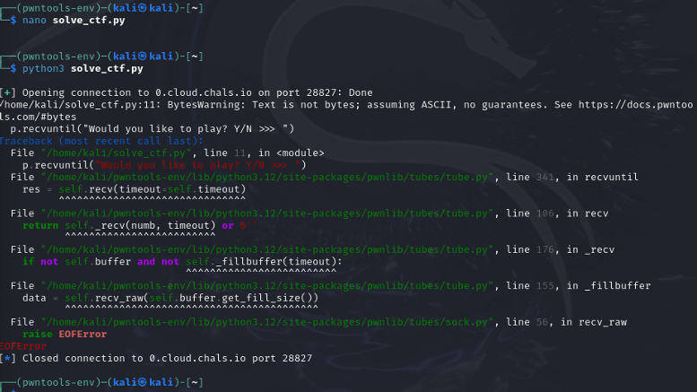
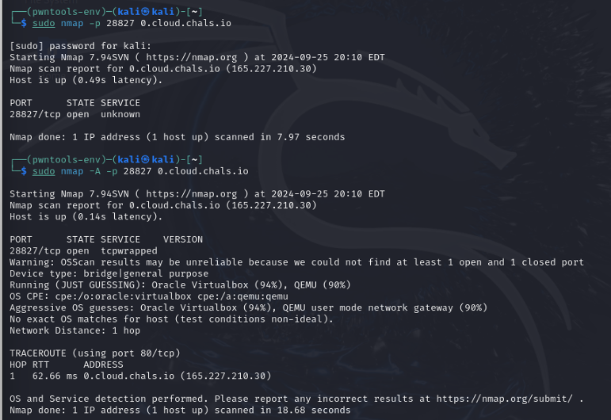
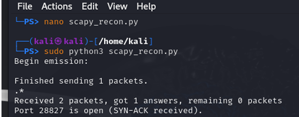
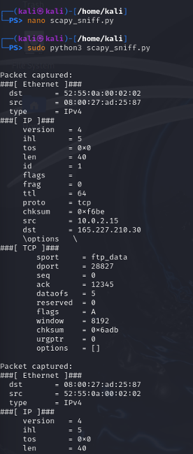
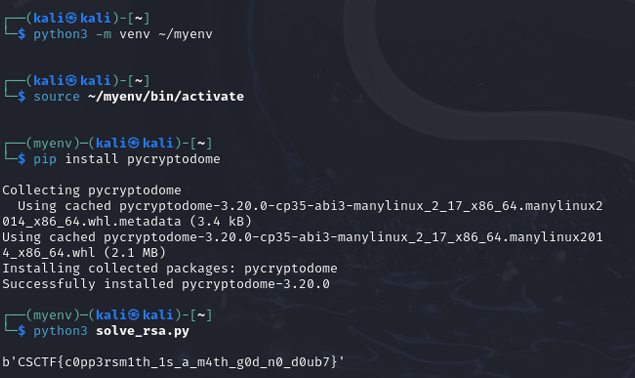
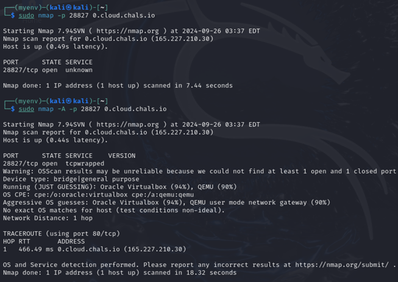

#  CTF Network & Cryptography Analysis — RSA + Blum Blum Shub Challenge


---

## 🧠 Objective

Perform reconnaissance, packet capture, and cryptographic decryption to solve a remote CTF challenge hosted on `0.cloud.chals.io:28827`.
The tasks included:

* Identifying open ports and analyzing services
* Observing TCP handshakes and traffic patterns
* Using **Pwntools** to solve a **Blum Blum Shub (PRNG)** challenge
* Decrypting an **RSA ciphertext** to recover the flag

---

## ⚙️ Tools & Setup

| Tool                  | Purpose                                             |
| --------------------- | --------------------------------------------------- |
| **Pwntools**          | Automate CTF interaction and exploit scripts        |
| **Nmap**              | Reconnaissance – open-port and OS/service discovery |
| **Wireshark**         | Capture and inspect TCP traffic on :28827           |
| **Scapy**             | Craft and analyze packets manually                  |
| **PyCryptodome**      | RSA decryption and modular arithmetic               |
| **Kali Linux 2024.x** | Execution environment                               |

Install everything quickly:

```
sudo apt update
sudo apt install python3-pwntools wireshark nmap python3-scapy
```

---

## 🧩 Step 1 — Pwntools Script Execution

1. Create the solver script:

   ```
   nano solve_ctf.py
   ```
2. Run:

   ```
   python3 solve_ctf.py
   ```
3. The script connected to the remote service, solved the Blum Blum Shub pseudorandom sequence, and received the flag.
   The connection then closed automatically, causing an expected `EOFError`.


*Fig 1 – Pwntools connecting to 0.cloud.chals.io:28827 and completing the challenge.*

---

## 🔍 Step 2 — Recon with Nmap

### Basic Scan

```
sudo nmap -p 28827 0.cloud.chals.io
```

Shows port 28827 as **open**.

### Aggressive Scan

```
sudo nmap -A -p 28827 0.cloud.chals.io
```

Revealed the service as **tcpwrapped** and OS fingerprint suggesting **VirtualBox/QEMU**.


*Fig 2 – Open port 28827 confirmed; aggressive scan shows tcpwrapped and virtualized host.*

---

## 📡 Step 3 — Traffic Inspection with Wireshark

Wireshark captured SYN, ACK, and PSH packets exchanged during Pwntools execution.
Filter used:

```
tcp.port == 28827
```


*Fig 3 – TCP stream analysis confirming successful SYN/ACK handshake.*

---

## 🧰 Step 4 — Scapy Packet Recon

### 4.1 Custom SYN Probe

```
from scapy.all import *
ip  = IP(dst="0.cloud.chals.io")
tcp = TCP(dport=28827, flags="S")
syn_pkt = ip/tcp
response = sr1(syn_pkt)
if response and response.getlayer(TCP).flags == "SA":
    print("Port 28827 is open (SYN-ACK received).")
```

Run:

```
sudo python3 scapy_recon.py
```


*Fig 4 – SYN-ACK received → port 28827 open.*

---

### 4.2 Packet Sniffing

```
from scapy.all import sniff
def packet_callback(packet):
    print("Packet captured:")
    packet.show()
sniff(filter="tcp port 28827", prn=packet_callback, count=10)
```

Run:

```
sudo python3 scapy_sniff.py
```


*Fig 5 – Detailed TCP/IP fields captured from port 28827 traffic.*

---

## 🔐 Step 5 — RSA Decryption Challenge

1. Create a virtual environment and install PyCryptodome:

```
python3 -m venv myenv
source myenv/bin/activate
pip install pycryptodome
```

2. Write the RSA solver (`solve_rsa.py`):

```
from Crypto.Util.number import long_to_bytes
e = 0x10001
n  = <provided modulus>
ct = <ciphertext>
p  = <known factor>
q  = n // p
phi = (p-1)*(q-1)
d   = pow(e, -1, phi)
m   = pow(ct, d, n)
print(long_to_bytes(m))
```

3. Run:

```
python3 solve_rsa.py
```

Output:

```
b'CSCTF{c0pp3rsm1th_1s_a_m4th_g0d_n0_d0ub7}'
```


*Fig 6 – RSA ciphertext successfully decrypted and flag recovered.*

---

## 🧠 Step 6 — Wireshark and Scapy Cross-Verification

Nmap, Wireshark, and Scapy were used together to confirm the host’s network state:


*Fig 7 – Cross-tool verification of port 28827 accessibility.*


*Fig 8 – Final SYN-ACK confirmation after RSA flag retrieval.*

---

## ✅ Key Takeaways

| Area                      | Skill Demonstrated                                              |
| ------------------------- | --------------------------------------------------------------- |
| **Cryptography**          | Decrypted RSA using PyCryptodome and mathematical factorization |
| **Network Forensics**     | Used Wireshark and Scapy to analyze TCP sessions                |
| **Automation**            | Built Pwntools script to interact with remote challenge         |
| **Reconnaissance**        | Verified open ports and services via Nmap                       |
| **Cross-tool validation** | Combined results from multiple forensic utilities               |

---

## 🔒 Security Implications

1. Services running with minimal banner information (`tcpwrapped`) are harder to fingerprint.
2. PRNG and RSA challenges demonstrate how weak random number generation or shared factors can compromise encryption.
3. Defensive measures include regular key rotation and strong entropy sources.

---

## 🔗 Related Labs

| Repository                                                                                                    | Focus                                        |
| ------------------------------------------------------------------------------------------------------------- | -------------------------------------------- |
| [Learning-Nmap](https://github.com/DEVIKA-KISH/Learning-Nmap)                                                 | Port scanning & network enumeration          |
| [Learning-WebApp-Security-BurpSuite](https://github.com/DEVIKA-KISH/Learning-WebApp-Security-BurpSuite)       | Web vulnerability testing                    |
| [Learning-Memfetch](https://github.com/DEVIKA-KISH/Learning-Memfetch)                                         | Android memory forensics                     |
| [Learning-Malware-Analysis-with-Ghidra](https://github.com/DEVIKA-KISH/Learning-Malware-Analysis-with-Ghidra) | Static binary analysis & reverse engineering |

---

## 🧩 Summary

Demonstrates end-to-end analysis combining **network reconnaissance**, **traffic inspection**, and **cryptographic exploitation** using professional penetration-testing tools in Kali Linux.
Hands on learning across both **offensive** (packet crafting, PRNG analysis) and **defensive** (forensic observation, protocol validation) disciplines.

---

## 👩‍💻 Author

**Devika Kishor**
Master’s Student in Cybersecurity | Florida Institute of Technology

